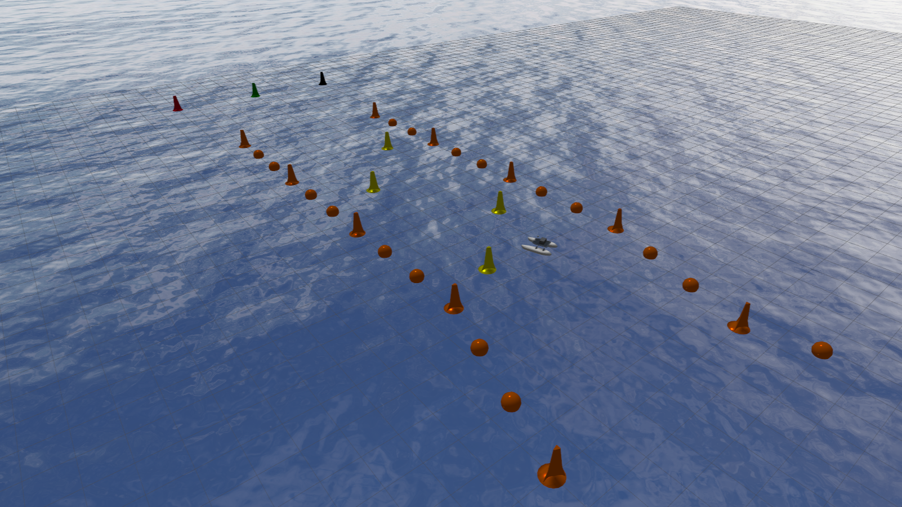
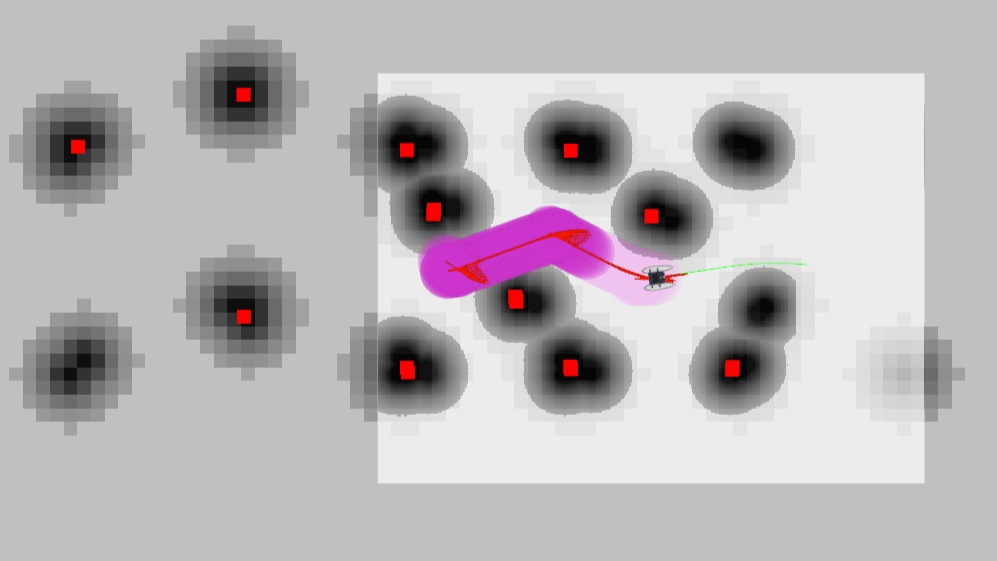
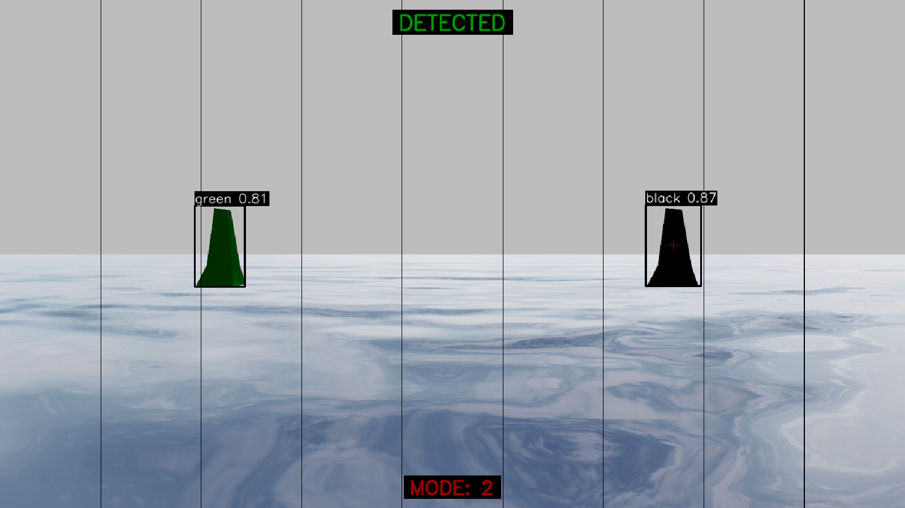

# YILDIZ USV

[](https://releases.ubuntu.com/22.04/)
[](https://docs.ros.org/en/humble/)
[](./LICENSE.txt)

This repository provides a Gazebo Garden-based simulation and ROS 2 Humble toolchain for rapid prototyping and validation of localization, perception, and Navigation2-based autonomy for the TEKNOFEST Unmanned Surface Vehicle competition.

<details>
<summary><strong>Project Structure</strong></summary>

```bash

.
├── CONTRIBUTING.md
├── images
│   ├── Robot_Localization_and_Navigation2_Image.png
│   ├── Simulation_Environment_Image.png
│   └── Targeted_Engagement_Image.png
├── LICENSE.txt
├── README.md
├── requirements.txt
├── workspace_gz
│   ├── CMakeLists.txt
│   ├── description
│   │   └── roboboat
│   │       └── roboboat.xacro
│   ├── launch
│   │   └── simulation.launch.py
│   ├── models
│   │   ├── buoys
│   │   │   ├── marker_buoy_black
│   │   │   │   ├── materials
│   │   │   │   │   └── textures
│   │   │   │   │       ├── MarkerBuoy_Base_Color.png
│   │   │   │   │       └── MarkerBuoy_Roughness.png
│   │   │   │   ├── meshes
│   │   │   │   │   └── marker_buoy.dae
│   │   │   │   ├── model.config
│   │   │   │   └── model.sdf
│   │   │   ├── marker_buoy_green
│   │   │   │   ├── materials
│   │   │   │   │   └── textures
│   │   │   │   │       ├── MarkerBuoy_Base_Color.png
│   │   │   │   │       └── MarkerBuoy_Roughness.png
│   │   │   │   ├── meshes
│   │   │   │   │   └── marker_buoy.dae
│   │   │   │   ├── model.config
│   │   │   │   └── model.sdf
│   │   │   ├── marker_buoy_orange
│   │   │   │   ├── materials
│   │   │   │   │   └── textures
│   │   │   │   │       ├── MarkerBuoy_Base_Color.png
│   │   │   │   │       └── MarkerBuoy_Roughness.png
│   │   │   │   ├── meshes
│   │   │   │   │   └── marker_buoy.dae
│   │   │   │   ├── model.config
│   │   │   │   └── model.sdf
│   │   │   ├── marker_buoy_red
│   │   │   │   ├── materials
│   │   │   │   │   └── textures
│   │   │   │   │       ├── MarkerBuoy_Base_Color.png
│   │   │   │   │       └── MarkerBuoy_Roughness.png
│   │   │   │   ├── meshes
│   │   │   │   │   └── marker_buoy.dae
│   │   │   │   ├── model.config
│   │   │   │   └── model.sdf
│   │   │   ├── marker_buoy_yellow
│   │   │   │   ├── materials
│   │   │   │   │   └── textures
│   │   │   │   │       ├── MarkerBuoy_Base_Color.png
│   │   │   │   │       └── MarkerBuoy_Roughness.png
│   │   │   │   ├── meshes
│   │   │   │   │   └── marker_buoy.dae
│   │   │   │   ├── model.config
│   │   │   │   └── model.sdf
│   │   │   └── round_buoy_orange
│   │   │       ├── materials
│   │   │       │   └── textures
│   │   │       │       ├── RoundBarrierBuoy_Base_Color.png
│   │   │       │       └── RoundBarrierBuoy_Roughness.png
│   │   │       ├── meshes
│   │   │       │   └── round_buoy.dae
│   │   │       ├── model.config
│   │   │       └── model.sdf
│   │   ├── roboboat
│   │   │   ├── materials
│   │   │   │   └── textures
│   │   │   │       ├── roboboat_albedo.png
│   │   │   │       ├── roboboat_metalness.png
│   │   │   │       ├── roboboat_normal.png
│   │   │   │       ├── roboboat_roughness.png
│   │   │   │       ├── thruster_albedo.png
│   │   │   │       └── thruster_roughness.png
│   │   │   ├── meshes
│   │   │   │   ├── housing.dae
│   │   │   │   ├── mount.dae
│   │   │   │   ├── prop.dae
│   │   │   │   └── roboboat.dae
│   │   │   └── sensors
│   │   │       ├── camera
│   │   │       │   ├── materials
│   │   │       │   │   └── textures
│   │   │       │   │       ├── camera_albedo.png
│   │   │       │   │       ├── camera_metalness.png
│   │   │       │   │       ├── camera_normal.png
│   │   │       │   │       ├── camera.png
│   │   │       │   │       └── camera_roughness.png
│   │   │       │   └── meshes
│   │   │       │       ├── camera_albedo.png
│   │   │       │       └── camera.dae
│   │   │       ├── camera_post
│   │   │       │   ├── materials
│   │   │       │   │   └── textures
│   │   │       │   │       └── post_albedo.png
│   │   │       │   └── meshes
│   │   │       │       ├── post_albedo.jpg
│   │   │       │       └── post.dae
│   │   │       ├── drybox
│   │   │       │   ├── materials
│   │   │       │   │   └── textures
│   │   │       │   │       ├── drybox_albedo.png
│   │   │       │   │       └── drybox_roughness.png
│   │   │       │   └── meshes
│   │   │       │       └── drybox.dae
│   │   │       ├── gps
│   │   │       │   ├── materials
│   │   │       │   │   └── textures
│   │   │       │   │       └── gps_albedo.png
│   │   │       │   └── meshes
│   │   │       │       ├── gps_albedo.png
│   │   │       │       └── gps.dae
│   │   │       ├── lidar
│   │   │       │   ├── materials
│   │   │       │   │   └── textures
│   │   │       │   │       ├── lidar_albedo.png
│   │   │       │   │       ├── lidar_metalness.png
│   │   │       │   │       ├── lidar_normal.png
│   │   │       │   │       ├── lidar.png
│   │   │       │   │       └── lidar_roughness.png
│   │   │       │   └── meshes
│   │   │       │       ├── lidar_albedo.png
│   │   │       │       └── lidar.dae
│   │   │       └── lidar_post
│   │   │           ├── materials
│   │   │           │   └── textures
│   │   │           │       └── post_albedo.png
│   │   │           └── meshes
│   │   │               ├── post_albedo.jpg
│   │   │               └── post.dae
│   │   └── waves
│   │       ├── materials
│   │       │   ├── programs
│   │       │   │   ├── GerstnerWaves_fs_330.glsl
│   │       │   │   └── GerstnerWaves_vs_330.glsl
│   │       │   └── textures
│   │       │       ├── skybox_lowres.dds
│   │       │       └── wave_normals.dds
│   │       ├── meshes
│   │       │   └── waterlow.dae
│   │       ├── model.config
│   │       └── model.sdf
│   ├── package.xml
│   ├── plugins
│   │   ├── AcousticPerceptionScoringPlugin.cc
│   │   ├── AcousticPerceptionScoringPlugin.hh
│   │   ├── AcousticPingerPlugin.cc
│   │   ├── AcousticPingerPlugin.hh
│   │   ├── AcousticTrackingScoringPlugin.cc
│   │   ├── AcousticTrackingScoringPlugin.hh
│   │   ├── BallShooterPlugin.cc
│   │   ├── BallShooterPlugin.hh
│   │   ├── GymkhanaScoringPlugin.cc
│   │   ├── GymkhanaScoringPlugin.hh
│   │   ├── LightBuoyPlugin.cc
│   │   ├── LightBuoyPlugin.hh
│   │   ├── NavigationScoringPlugin.cc
│   │   ├── NavigationScoringPlugin.hh
│   │   ├── PerceptionScoringPlugin.cc
│   │   ├── PerceptionScoringPlugin.hh
│   │   ├── PlacardPlugin.cc
│   │   ├── PlacardPlugin.hh
│   │   ├── PolyhedraBuoyancyDrag.cc
│   │   ├── PolyhedraBuoyancyDrag.hh
│   │   ├── PolyhedronVolume.cc
│   │   ├── PolyhedronVolume.hh
│   │   ├── PublisherPlugin.cc
│   │   ├── PublisherPlugin.hh
│   │   ├── ScanDockScoringPlugin.cc
│   │   ├── ScanDockScoringPlugin.hh
│   │   ├── ScoringPlugin.cc
│   │   ├── ScoringPlugin.hh
│   │   ├── ShapeVolume.cc
│   │   ├── ShapeVolume.hh
│   │   ├── SimpleHydrodynamics.cc
│   │   ├── SimpleHydrodynamics.hh
│   │   ├── StationkeepingScoringPlugin.cc
│   │   ├── StationkeepingScoringPlugin.hh
│   │   ├── Surface.cc
│   │   ├── Surface.hh
│   │   ├── USVWind.cc
│   │   ├── USVWind.hh
│   │   ├── Wavefield.cc
│   │   ├── Wavefield.hh
│   │   ├── WaveVisual.cc
│   │   ├── WaveVisual.hh
│   │   ├── WayfindingScoringPlugin.cc
│   │   ├── WayfindingScoringPlugin.hh
│   │   ├── WaypointMarkers.cc
│   │   ├── WaypointMarkers.hh
│   │   ├── WildlifeScoringPlugin.cc
│   │   └── WildlifeScoringPlugin.hh
│   └── worlds
│       └── world.sdf
├── workspace_nav
│   ├── config
│   │   ├── map.yaml
│   │   └── nav2_params.yaml
│   ├── json
│   │   ├── target_buoy.json
│   │   └── waypoints.json
│   ├── launch
│   │   └── nav2.launch.py
│   ├── map
│   │   └── map.pgm
│   ├── package.xml
│   ├── resource
│   │   └── workspace_nav
│   ├── scripts
│   │   ├── __init__.py
│   │   ├── waypoint_transform.py
│   │   └── waypoint_with_state.py
│   ├── setup.cfg
│   └── setup.py
└── workspace_ros
    ├── config
    │   ├── ekf.yaml
    │   ├── navsat.yaml
    │   └── static_transform.yaml
    ├── launch
    │   └── localization.launch.py
    ├── package.xml
    ├── resource
    │   └── workspace_ros
    ├── scripts
    │   ├── converter.py
    │   ├── gps_covariance_repub.py
    │   ├── imu_covariance_repub.py
    │   ├── __init__.py
    │   ├── kamikaze.py
    │   ├── manual_control.py
    │   ├── static_transform_publisher.py
    │   └── target_buoy.py
    ├── setup.cfg
    ├── setup.py
    └── YOLOv11
        └── YOLOv11.pt

```

</details>

## Simulation Environment



*Figure: Gazebo Garden simulation environment illustrating the USV model, buoy configurations, and hydrodynamic interactions used for testing perception, localization, and autonomous navigation pipelines.*

## Robot Localization and Navigation2


*Figure: RViz2 visualization of the Localization and Navigation2 stack — EKF-based IMU/GPS fusion for state estimation, with Navigation2 handling path planning and obstacle avoidance.*

## Targeted Engagement



*Figure: Visualization of real-time target detection and interception — YOLO-based buoy segmentation with corresponding motion commands for direct intercept maneuvers and live detection/navigation feedback.*

<details>
<summary>Algorithm Overview</summary>

- **Purpose:** Processes camera frames with a YOLO segmentation model to detect the target buoy and generate intercept commands.

- **Target configuration:** The target tag is read from `workspace_nav/json/target_buoy.json`.

- **Inference & selection:** The node performs model inference per frame, selects the highest-confidence detection that matches the configured target, and determines its horizontal column position.

- **Control output:** Maps the detection column to simple linear/angular `geometry_msgs/Twist` commands and publishes them on `/cmd_vel_nav`. If no detection is available, a fallback search (recovery) behavior is used.

- **Visualization:** Detections, labels and status are rendered in an OpenCV window for debugging and operator feedback.

- **Model lookup:** `workspace_ros/YOLOv11/YOLOv11.pt`.

- **Key topics:** image input `/roboboat/sensors/camera/image`; command output `/cmd_vel_nav`.

</details

---

## DEPENDENCIES

### Step 1 — Install ROS 2 Humble and Gazebo Garden:

- [ROS 2 Humble](https://docs.ros.org/en/humble/Installation/Ubuntu-Install-Debs.html)
- [Gazebo Garden](https://gazebosim.org/docs/garden/install_ubuntu/)
---
### Step 2 — Install additional dependencies:

```bash
sudo apt update
sudo apt install -y python3-sdformat13 \
ros-humble-ros-gzgarden \
ros-humble-xacro \
ros-humble-joint-state-publisher \
ros-humble-robot-localization \
ros-humble-nav2-bringup \
ros-humble-navigation2
```
---
### Step 3 — Create a workspace and clone the repository:

```bash
mkdir -p ~/yildiz_ws/src
cd ~/yildiz_ws/src
git clone https://github.com/YILDIZ-USV/YILDIZ-USV.git
```
---
### Step 4 — Install Python dependencies:

```bash
cd YILDIZ-USV
pip install -r requirements.txt
```
---
### Step 5 — Source the ROS 2 installation:

```bash
source /opt/ros/humble/setup.bash
```
---
### Step 6 — Build the workspace:

```bash
cd ~/yildiz_ws
colcon build --merge-install
```
---
### Step 7 — Source the workspace:

```bash
source ~/yildiz_ws/install/setup.bash
```

## QUICKSTART

### Prerequisites

Before proceeding, ensure the following are installed and configured:

* **Operating System:** [Ubuntu 22.04](https://releases.ubuntu.com/jammy/)
* **ROS 2:** [Humble Hawksbill](https://docs.ros.org/en/humble/Installation/Ubuntu-Install-Debs.html)
* **Simulation Environment:** [Gazebo Garden](https://gazebosim.org/docs/garden/install_ubuntu/)
* **GCS:** [Ground Control Station](https://github.com/YILDIZ-USV/GROUND-CONTROL-STATION.git) repository.
* **Workspace:** Ensure that the workspace has been successfully built.

**Before running any Quickstart commands, make sure you have sourced the following:**

```bash
source /opt/ros/humble/setup.bash
source ~/yildiz_ws/install/setup.bash
```
---
### 1. Start the simulation:

```bash
ros2 launch workspace_gz simulation.launch.py
```
---
### 2. Start the localization:

```bash
ros2 launch workspace_ros localization.launch.py
```
---
### 3. Bring up Navigation2:

```bash
ros2 launch workspace_nav nav2.launch.py
```
---
### 4. Run the converter node:

```bash
ros2 run workspace_ros converter
```
---
### 5. Run the target_buoy node:

> **Note:** Before running the `target_buoy` node, the engagement target information must be provided by the [Ground Control Station](https://github.com/YILDIZ-USV/GROUND-CONTROL-STATION.git).

```bash
ros2 run workspace_ros target_buoy
```
---
### 6. Run the waypoint_transform node:

> **Note:** Before running the `waypoint_transform` node, the mission waypoint latitude and longitude data must be provided by the [Ground Control Station](https://github.com/YILDIZ-USV/GROUND-CONTROL-STATION.git).

```bash
ros2 run workspace_nav waypoint_transform
```
---
### 7. Run the waypoint_with_state node:

```bash
ros2 run workspace_nav waypoint_with_state
```

## MAINTAINERS

* **Görkem Direybatoğulları** — GitHub: [@GorkemDireybatogullari](https://github.com/GorkemDireybatogullari)
* **Mustafa Berat Yavaş** — GitHub: [@MustafaBeratYavas](https://github.com/MustafaBeratYavas)
* **Muhammet Al** — GitHub: [@MuhammetAll](https://github.com/MuhammetAll)
* **Muhammed Kerem Demirbent** — GitHub: [@MuhammedKeremDemirbent](https://github.com/MuhammedKeremDemirbent)
* **Harun Kurt** — GitHub: [@harunkurtdev](https://github.com/harunkurtdev)

## CONTRIBUTING

For contribution guidelines, please see the [CONTRIBUTING.md](CONTRIBUTING.md) file.

## REFERENCES

[Toward Maritime Robotic Simulation in Gazebo](https://wiki.nps.edu/display/BB/Publications?preview=/1173263776/1173263778/PID6131719.pdf)